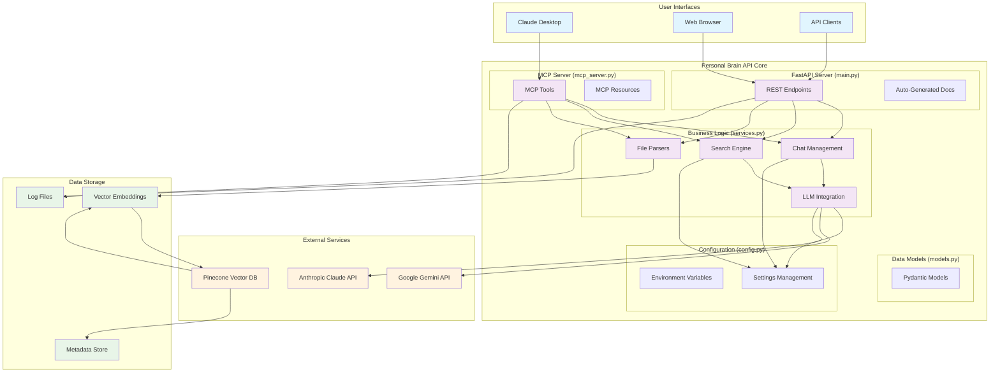
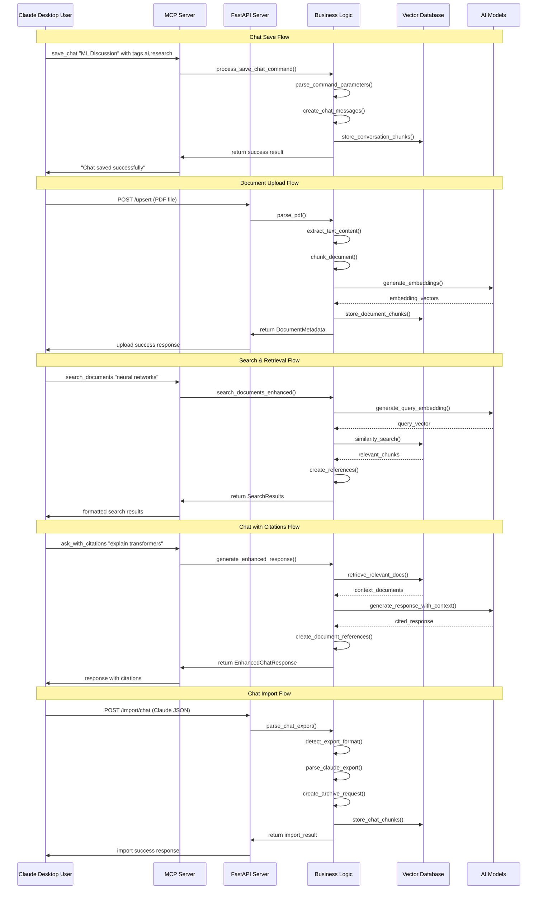
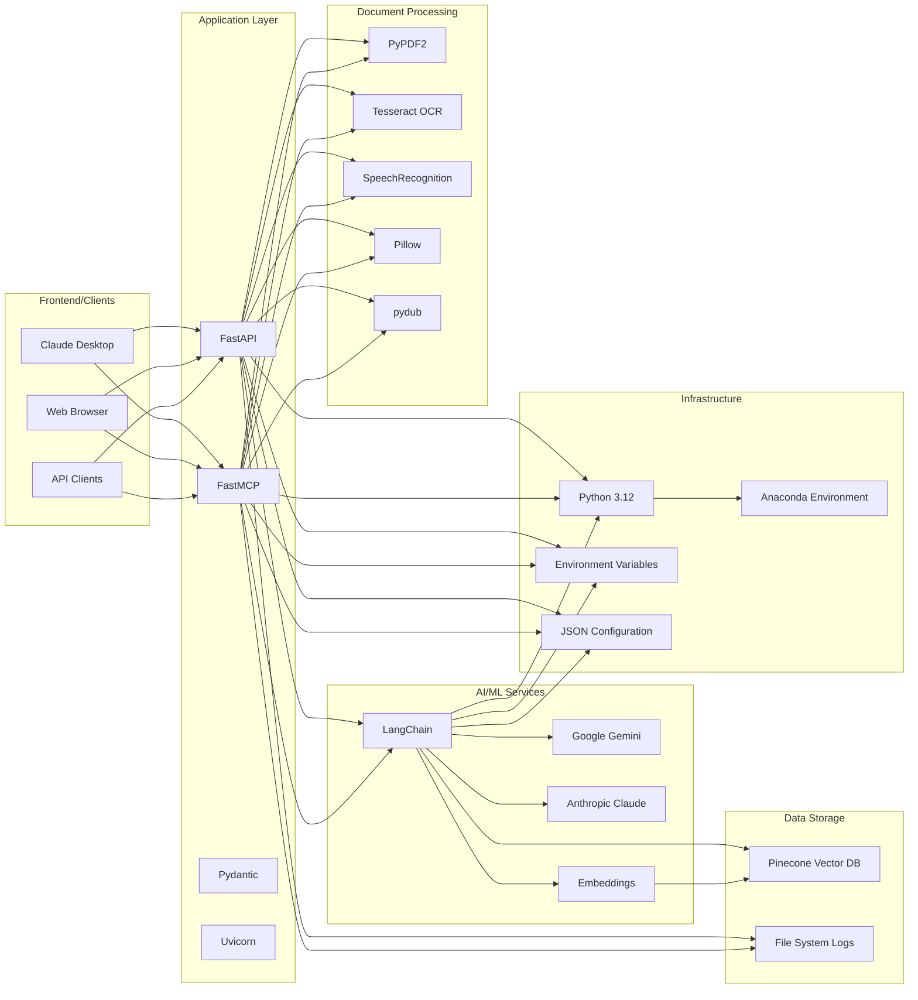

# Personal Brain API Architecture

## System Overview Diagram



## Detailed Component Architecture

```mermaid
flowchart TB
    subgraph "Claude Desktop Integration"
        CD[Claude Desktop Client]
        MCP[MCP Protocol Handler]
    end
    
    subgraph "Personal Brain MCP Server"
        subgraph "Tools Layer"
            T1[search_documents]
            T2[save_chat]
            T3[retrieve_saved_chats]
            T4[import_chat_export]
            T5[ask_with_citations]
            T6[list_all_documents]
            T7[get_document_details]
            T8[search_chat_history]
            T9[process_chat_command]
        end
        
        subgraph "Resources Layer"
            R1[documents://list]
            R2[documents://{id}]
            R3[chats://saved]
            R4[chats://{id}]
        end
    end
    
    subgraph "FastAPI Web Server"
        subgraph "Core Endpoints"
            E1[POST /upsert]
            E2[POST /archive/chat]
            E3[GET /search]
            E4[POST /chat/enhanced]
        end
        
        subgraph "Chat Management Endpoints"
            E5[POST /import/chat]
            E6[POST /chats/save]
            E7[POST /chats/retrieve]
            E8[GET /chats]
            E9[DELETE /chats/{id}]
            E10[POST /command/save_chat]
            E11[POST /command/retrieve_chat]
        end
        
        subgraph "Document Endpoints"
            E12[GET /search/documents]
            E13[GET /documents]
            E14[GET /documents/{id}]
        end
    end
    
    subgraph "Service Layer Functions"
        subgraph "File Processing"
            F1[parse_pdf]
            F2[parse_image]
            F3[parse_audio]
            F4[parse_text_export]
            F5[parse_claude_export]
            F6[parse_chatgpt_export]
        end
        
        subgraph "Chat Management"
            C1[save_chat_conversation]
            C2[retrieve_chat_conversations]
            C3[archive_chat_session]
            C4[process_save_chat_command]
            C5[process_retrieve_chat_command]
        end
        
        subgraph "Search & Retrieval"
            S1[search_documents_enhanced]
            S2[search_archived_chats_enhanced]
            S3[generate_enhanced_response]
            S4[get_all_documents]
            S5[get_document_with_chunks]
        end
        
        subgraph "Vector Operations"
            V1[process_and_store_enhanced]
            V2[vectorstore operations]
            V3[embedding generation]
        end
    end
    
    subgraph "Data Models"
        M1[ChatMessage]
        M2[DocumentReference]
        M3[SearchResult]
        M4[ArchiveRequest]
        M5[SaveChatRequest]
        M6[DocumentMetadata]
        M7[EnhancedChatResponse]
    end
    
    subgraph "External Integrations"
        EXT1[Pinecone Vector DB]
        EXT2[Google Gemini API]
        EXT3[Anthropic Claude API]
        EXT4[Tesseract OCR]
        EXT5[SpeechRecognition]
    end
    
    %% Connections
    CD --> MCP
    MCP --> T1 & T2 & T3 & T4 & T5 & T6 & T7 & T8 & T9
    MCP --> R1 & R2 & R3 & R4
    
    T1 & T2 & T3 & T4 & T5 & T6 & T7 & T8 & T9 --> S1 & S2 & S3 & C1 & C2
    R1 & R2 & R3 & R4 --> S4 & S5 & C2
    
    E1 & E2 & E3 & E4 --> F1 & F2 & F3 & C3 & S1 & S3
    E5 & E6 & E7 & E8 & E9 --> F5 & F6 & C1 & C2 & C4 & C5
    E10 & E11 --> C4 & C5
    E12 & E13 & E14 --> S1 & S4 & S5
    
    F1 & F2 & F3 --> V1
    F4 & F5 & F6 --> C1 & C3
    S1 & S2 & S3 --> V2 & V3
    C1 & C2 & C3 --> V2
    
    V2 --> EXT1
    V3 --> EXT2
    S3 --> EXT2 & EXT3
    F2 --> EXT4
    F3 --> EXT5
    
    %% All components use models
    T1 & T2 & T3 & T4 & T5 & T6 & T7 & T8 & T9 -.-> M1 & M2 & M3 & M4 & M5 & M6 & M7
    E1 & E2 & E3 & E4 & E5 & E6 & E7 & E8 & E9 & E10 & E11 & E12 & E13 & E14 -.-> M1 & M2 & M3 & M4 & M5 & M6 & M7
    
    %% Styling
    classDef client fill:#e3f2fd
    classDef mcpLayer fill:#f3e5f5
    classDef apiLayer fill:#e8f5e8
    classDef serviceLayer fill:#fff3e0
    classDef modelLayer fill:#fce4ec
    classDef external fill:#f1f8e9
    
    class CD,MCP client
    class T1,T2,T3,T4,T5,T6,T7,T8,T9,R1,R2,R3,R4 mcpLayer
    class E1,E2,E3,E4,E5,E6,E7,E8,E9,E10,E11,E12,E13,E14 apiLayer
    class F1,F2,F3,F4,F5,F6,C1,C2,C3,C4,C5,S1,S2,S3,S4,S5,V1,V2,V3 serviceLayer
    class M1,M2,M3,M4,M5,M6,M7 modelLayer
    class EXT1,EXT2,EXT3,EXT4,EXT5 external
```

## Data Flow Architecture



## Technology Stack



## File Structure

```
python-mcp/
├── main.py                    # FastAPI server with REST endpoints
├── mcp_server.py             # MCP server for Claude Desktop
├── services.py               # Business logic and AI integrations
├── models.py                 # Pydantic data models
├── config.py                 # Configuration and settings
├── requirements.txt          # Python dependencies
├── start_mcp_server.sh      # MCP server startup script
├── test_setup.py            # Setup verification script
├── test_mcp_startup.py      # MCP server test script
├── claude_desktop_config.json    # Claude Desktop configuration
├── claude_desktop_config_alternative.json  # Alternative config
├── .env.template            # Environment variables template
├── CLAUDE.md                # Development documentation
├── setup_mcp.md            # MCP setup guide
├── CHAT_MANAGEMENT_COMPLETE.md  # Complete usage guide
├── CLAUDE_DESKTOP_SETUP.md  # Claude Desktop setup guide
├── SETUP_SUCCESS.md         # Success confirmation guide
└── ARCHITECTURE_DIAGRAM.md  # This file
```

This architecture provides a comprehensive, scalable personal knowledge management system with seamless Claude Desktop integration and powerful AI-driven search and chat capabilities.