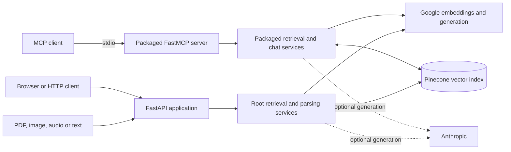

# Personal Brain MCP

Document retrieval and conversation memory for MCP clients, with a separate FastAPI interface for uploading and exploring a personal knowledge base.

Personal Brain turns PDFs, images, audio, and saved conversations into searchable text. It combines Google embeddings with Pinecone storage, and exposes retrieval and citation-bearing answers through MCP tools. This is a source-based integration project; provider credentials and a compatible Pinecone index are required.

[Architecture](#architecture) · [Setup](#setup) · [MCP tools](#mcp-tools) · [Code guide](#code-guide)

## What it does

- Extracts PDF text, image text with Tesseract, and audio transcripts.
- Chunks content and stores vectors with document metadata in Pinecone.
- Searches documents and archived conversations, with filters and source references.
- Saves, lists, retrieves, and imports conversations through MCP tools.
- Generates retrieval-grounded answers with document citations.

The installed MCP entry point currently registers **10 tools and 5 resources**. Graph traversal and hybrid graph-search tools are not registered in that entry point. The MCP process and HTTP server are separate applications; starting one does not start the other.

## Architecture



The repository carries separate root and packaged service modules. Changes to retrieval behavior should account for both entry points. Document parsing happens in Python; embedding, vector storage, and model requests use external services.

## Setup

Use **Python 3.10+**: the source uses union type syntax even though package metadata advertises an older minimum. Tesseract is needed for image OCR; FFmpeg is needed for audio formats handled through pydub.

```bash
git clone https://github.com/anudeepadi/personal-brain-mcp.git
cd personal-brain-mcp
python3 -m venv .venv
source .venv/bin/activate
python -m pip install -e .
python -m pip install python-multipart
cp .env.example .env
```

`python-multipart` is needed by the HTTP file-upload routes but is absent from the root dependency lists. Configure these values in your local environment:

| Variable | Purpose |
| --- | --- |
| `GOOGLE_API_KEY` | Embeddings and Google model access |
| `PINECONE_API_KEY` | Vector-store access |
| `PINECONE_INDEX_NAME` | Existing index compatible with the embedding model |
| `ANTHROPIC_API_KEY` | Optional alternative generation provider |

The service modules hard-code model IDs and the dependencies are not locked. Confirm model availability and dependency compatibility before a live run; installation alone does not establish a working provider connection.

### HTTP interface

From the repository root, with configuration in `.env`:

```bash
python -m uvicorn main:app --host 127.0.0.1 --port 8000 --reload
```

Open [local API documentation](http://localhost:8000/docs). The root path serves the included static frontend.

```bash
curl -F 'file=@notes.pdf' http://localhost:8000/upsert
curl --get --data-urlencode 'q=architecture decisions'   http://localhost:8000/search/documents
```

`notes.pdf` is a file you supply. Document search uses `/search/documents`; `/search` queries archived chats.

### MCP interface

The source installation creates the `personal-brain-mcp` executable in `.venv/bin/`. Configure your MCP client to launch that executable with an **absolute path**, and pass the required environment variables through the client's private configuration. A desktop client may not inherit the repository's working directory or `.env` file.

For a terminal-based client that inherits the current directory and environment:

```bash
.venv/bin/personal-brain-mcp
```

The process waits for an MCP client on stdio; it is not an interactive shell.

## MCP tools

| Workflow | Registered tools |
| --- | --- |
| Document discovery | `search_documents`, `get_document_details`, `list_all_documents` |
| Grounded answers | `ask_with_citations` |
| Conversation memory | `search_chat_history`, `save_chat`, `retrieve_saved_chats`, `list_saved_chats` |
| Import and commands | `import_chat_export`, `process_chat_command` |

## Code guide

| Path | Responsibility |
| --- | --- |
| [personal_brain_mcp/server.py](personal_brain_mcp/server.py) | Installed MCP tools and resources |
| [personal_brain_mcp/services.py](personal_brain_mcp/services.py) | Packaged retrieval, parsing, and conversation operations |
| [main.py](main.py) | HTTP routes and static frontend mounting |
| [services.py](services.py) | HTTP application's service implementation |
| [pyproject.toml](pyproject.toml) | Package metadata and command entry point |
| [frontend/](frontend/) | Static browser interface |

## Development and limits

Use the source tree above to review the actual tool and route contracts. Older packaging folders and publishing notes are historical variants, not additional required services. Provider-backed smoke checks require configured accounts; this README does not claim a fresh end-to-end run or current package-registry availability.

The HTTP application has no authentication layer. Keep local exploration on loopback. Documents and prompts can leave the machine through configured providers, so this is not an offline memory store.

For contributions, identify the affected entry point, include a small reproduction, and explain whether a change touches both service copies.

## License

The package declares MIT in [pyproject.toml](pyproject.toml); the repository includes an [MIT license in the nested distribution](personal-brain-mcp/LICENSE). Review that distribution's notices when redistributing.
