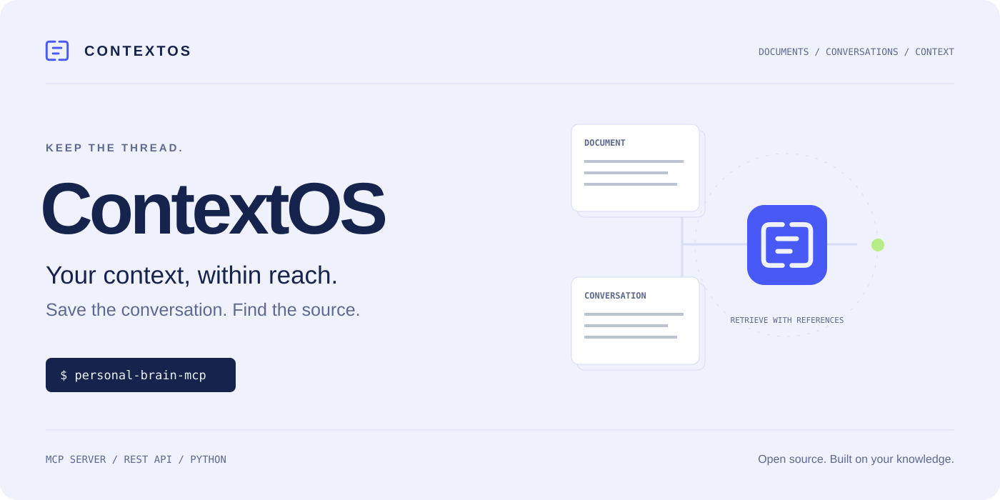
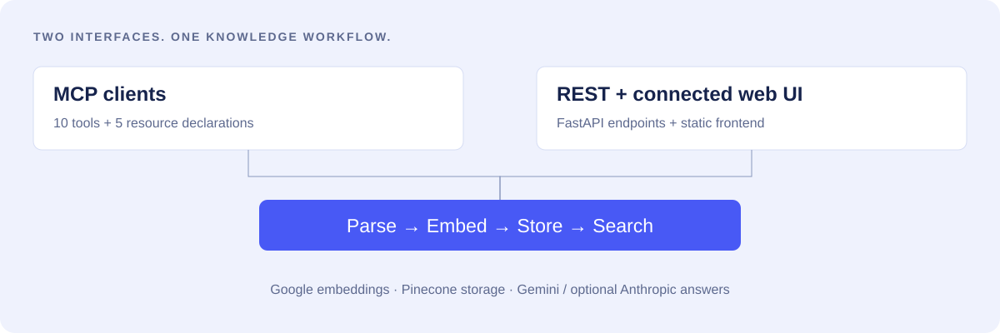
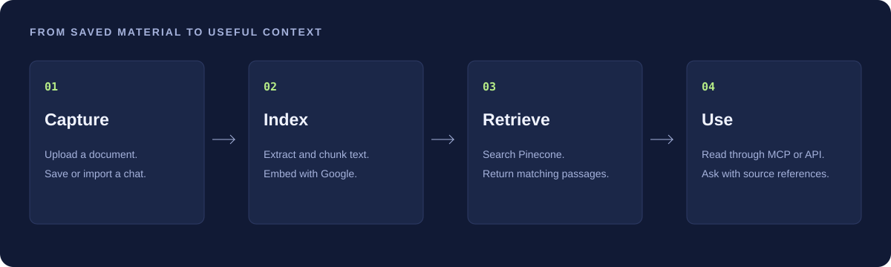

<p align="center">
  <picture>
    <source media="(prefers-color-scheme: dark)" srcset="docs/assets/hero-dark.svg">
    <source media="(prefers-color-scheme: light)" srcset="docs/assets/hero-light.svg">
    
  </picture>
</p>

<p align="center"><strong>Document retrieval and conversation memory for your AI workflows.</strong><br>MCP for assistants. REST for applications. Your saved knowledge, ready to retrieve.</p>

<p align="center">
  <a href="#quickstart">Quickstart</a> ·
  <a href="docs/SETUP.md">Setup guide</a> ·
  <a href="docs/TOOLS.md">MCP tools</a> ·
  <a href="docs/ARCHITECTURE.md">Architecture</a> ·
  <a href="CONTRIBUTING.md">Contribute</a>
</p>

<p align="center">
  <a href="LICENSE"></a>
  <a href="pyproject.toml"></a>
  <a href="docs/TOOLS.md"></a>
  <a href="ROADMAP.md"></a>
</p>

---

Important context is spread across documents and conversations. **ContextOS gives that material a retrieval layer.** Upload a file, save a discussion, or import a chat export. Search the stored passages and ask questions with document references through an MCP client or the REST API.

**ContextOS is the project identity.** The GitHub repository, Python distribution, and executable retain the name `personal-brain-mcp` for compatibility. It is an MCP server plus a FastAPI application; it is not an operating system or an automatic recorder of every conversation.

## Choose your entry point

| You want to… | Start here |
|---|---|
| Give an MCP-compatible assistant access to saved knowledge | [MCP setup](docs/SETUP.md#mcp-client-configuration) |
| Upload documents and query them over HTTP | [REST quickstart](#run-the-api-and-connected-ui) |
| Understand the storage and provider boundaries | [Architecture](docs/ARCHITECTURE.md) |
| Work on the project | [Contributor guide](CONTRIBUTING.md) |

<p align="center"></p>

## Quickstart

Requires **Python 3.11+**, [uv](https://docs.astral.sh/uv/getting-started/installation/), a Google API key, and a Pinecone index and key. Anthropic is optional. The application runs on your machine; embeddings, storage, and model inference use external providers.

```bash
git clone https://github.com/anudeepadi/personal-brain-mcp.git
cd personal-brain-mcp
uv sync
cp .env.example .env
```

Set the three required values in `.env`:

```dotenv
GOOGLE_API_KEY=your-google-key
PINECONE_API_KEY=your-pinecone-key
PINECONE_INDEX_NAME=your-index-name
```

The index must match the embedding model's dimensions. Model identifiers are configured in the service code and need live provider validation before an end-to-end run; see [setup and current limits](docs/SETUP.md).

### Run the MCP server

```bash
uv run personal-brain-mcp
```

This starts a **stdio MCP server**, intended to be launched by an MCP client. It is not an interactive chat shell. Use the [portable client configuration example](examples/claude_desktop_config.json), replacing its absolute paths with your own checkout and `uv` locations.

### Run the API and connected UI

From the repository root:

```bash
uv run uvicorn main:app --host 127.0.0.1 --port 8000
```

Open **http://127.0.0.1:8000** for the connected static UI, or **http://127.0.0.1:8000/docs** for the API schema. The separate `frontend-next/` directory is a UI prototype; its controls are not wired to this API.

```bash
curl -F 'file=@examples/notes.txt' http://127.0.0.1:8000/upsert
curl --get --data-urlencode 'q=architecture decisions' \
  http://127.0.0.1:8000/search/documents
```

The API currently has no authentication and allows broad CORS. Bind it to localhost; add access controls before hosting it for others. See [security and data handling](SECURITY.md).

## What ContextOS does

<p align="center"></p>

| Capability | Implementation |
|---|---|
| **Document retrieval** | Chunked text, Google embeddings, and Pinecone similarity search with metadata filters. |
| **Conversation memory** | Explicitly save, list, retrieve, and search chats with titles and tags. |
| **Chat import** | Parsers for supported Claude and ChatGPT JSON shapes and role-labeled text. Export formats can change. |
| **Source references** | Search results and enhanced answers include document identifiers, excerpts, and chunk references. |
| **File processing** | Text and PDF extraction; image OCR with Tesseract; audio transcription with additional system dependencies. |
| **Two interfaces** | Ten MCP tools and five resource declarations, plus REST endpoints and a connected static UI. |

Reference metadata helps you inspect an answer's sources; it does not establish that every generated statement is correct. Saving conversations is explicit, not automatic background memory.

## MCP tools at a glance

| Task | Tools |
|---|---|
| Find documents | `search_documents`, `get_document_details`, `list_all_documents` |
| Ask about stored material | `ask_with_citations` |
| Keep and retrieve conversations | `save_chat`, `search_chat_history`, `retrieve_saved_chats`, `list_saved_chats` |
| Import and organize | `import_chat_export`, `process_chat_command` |

[Tool and resource reference →](docs/TOOLS.md)

## Built to extend

```text
personal_brain_mcp/   Installable MCP server, models, settings, and services
main.py              FastAPI application (run from the source checkout)
services.py          REST service implementation
frontend/            Static UI connected to the API
frontend-next/       Separate Next.js UI prototype
examples/            Portable MCP config and sample document
scripts/             Offline repository validation and original artwork generator
docs/                Setup, architecture, tools, status, and brand assets
```

Older `npm-package/` and nested `personal-brain-mcp/` trees are historical packaging attempts. The root `pyproject.toml` is the maintained build entry point. This update ships GitHub distributions; it does not claim a new PyPI or npm publication.

## Current status

ContextOS is a **preview**. Live provider compatibility, ingestion quality, and retrieval quality need further validation. Knowledge-graph search, local embeddings, automatic sync, and multi-user authentication are roadmap items, not current capabilities.

The old setup reports and architecture diagrams at the repository root are historical notes. Use the linked `docs/` guides for the current supported entry points and known limitations.

- [Setup and configuration](docs/SETUP.md)
- [Architecture and data flow](docs/ARCHITECTURE.md)
- [Known limitations and roadmap](ROADMAP.md)
- [Contributing](CONTRIBUTING.md) · [Changelog](CHANGELOG.md)
- [Security](SECURITY.md) · [Brand assets](docs/BRAND.md)

## License

[MIT](LICENSE). Original license attribution is preserved. Maintained by [Anudeep Adiraju](https://github.com/anudeepadi).

<p align="center"><sub>Keep the thread.</sub></p>
