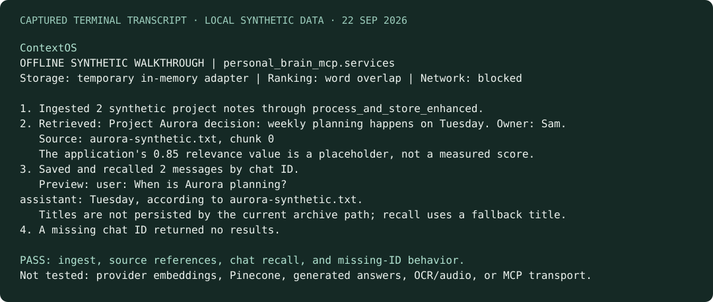
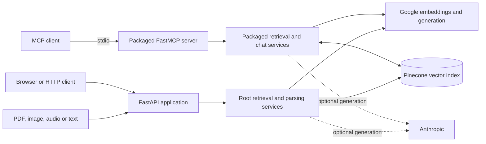

# ContextX — Organizational Memory

Document retrieval and conversation memory for MCP clients, with a separate FastAPI interface for uploading and exploring a personal knowledge base.

ContextX turns PDFs, images, audio, and saved conversations into searchable text. It combines Google embeddings with Pinecone storage and exposes retrieval and source-referenced answers through MCP tools. The repository and command retain the `personal-brain-mcp` name for continuity.

**Status:** integration prototype with a verified local synthetic walkthrough. Live retrieval requires provider credentials and a compatible Pinecone index. The local walkthrough below runs without accounts and makes no provider requests.

[Try the local walkthrough](#try-the-local-walkthrough) · [Architecture](#architecture) · [Provider setup](#provider-setup) · [MCP tools](#mcp-tools) · [Code guide](#code-guide)

## Try the local walkthrough

Use **Python 3.12** with [uv](https://docs.astral.sh/uv/getting-started/installation/) for the verified setup below; the supported Python range is 3.10–3.12. The audio dependency currently uses `audioop`, which was removed from Python 3.13. Install from source; a published PyPI package is not required.

```bash
git clone https://github.com/anudeepadi/personal-brain-mcp.git
cd personal-brain-mcp
uv venv --python 3.12 .venv
source .venv/bin/activate
uv pip install -c docs/tested-constraints.txt -e .
python examples/offline_walkthrough.py
```

The walkthrough exercises the **actual service functions** for chunking, metadata, source references, chat serialization, and recall. A temporary in-memory adapter ranks word overlap in invented notes; embeddings and Pinecone are replaced, no LLM is called, and outbound sockets are blocked. This is an integration fixture, not offline semantic search or a measured provider benchmark.



See the [complete captured run](examples/offline-output.txt) and [runnable source](examples/offline_walkthrough.py). The image renders that terminal output; it is not a screenshot of a deployed UI. To exercise the separate HTTP service implementation with the same assertions, run `python examples/offline_walkthrough.py --entry http`.

The [dependency snapshot](docs/tested-constraints.txt) records the environment used on 22 September 2026. MCP is constrained to the 1.x SDK used by this server's FastMCP interface. These checks verify installation and local service behavior, not current provider models or production readiness.

## What it does

- Extracts PDF text, image text with Tesseract, and audio transcripts.
- Chunks content and stores vectors with document metadata in Pinecone.
- Searches documents and archived conversations, with filters and source references.
- Saves, lists, retrieves, and imports conversations through MCP tools.
- Generates retrieval-grounded answers with document citations.

The installed MCP entry point currently registers **10 tools, 2 fixed resources, and 3 resource templates**. Graph traversal and hybrid graph-search tools are not registered in that entry point. The MCP process and HTTP server are separate applications; starting one does not start the other.

## Architecture



The repository carries separate root and packaged service modules. Changes to retrieval behavior should account for both entry points. Document parsing happens in Python; embedding, vector storage, and model requests use external services.

## Provider setup

After the source installation above, copy the configuration template. Tesseract is needed for image OCR; FFmpeg is needed for audio formats handled through pydub. Neither is used in the text-only walkthrough.

```bash
cp .env.example .env
```

Configure these values in your local environment:

| Variable | Purpose |
| --- | --- |
| `GOOGLE_API_KEY` | Embeddings and Google model access |
| `PINECONE_API_KEY` | Vector-store access |
| `PINECONE_INDEX_NAME` | Existing index compatible with the embedding model |
| `ANTHROPIC_API_KEY` | Optional alternative generation provider |

The service modules hard-code older model IDs (`models/embedding-001`, `gemini-1.5-flash`, and `claude-3-haiku-20240307`). Confirm provider availability and use an index compatible with the chosen embedding dimensions before a live run. No current model/provider compatibility is claimed by the local check.

### HTTP interface

From the repository root, with configuration in `.env`:

```bash
python -m uvicorn main:app --host 127.0.0.1 --port 8000 --reload
```

Open [local API documentation](http://localhost:8000/docs). The root path serves the included static frontend.

```bash
curl -F 'file=@notes.pdf' http://localhost:8000/upsert
curl --get --data-urlencode 'q=architecture decisions'   http://localhost:8000/search/documents
```

`notes.pdf` is a file you supply. Document search uses `/search/documents`; `/search` queries archived chats.

### MCP interface

The source installation creates the `personal-brain-mcp` executable in `.venv/bin/`. Configure your MCP client to launch that executable with an **absolute path**, and pass the required environment variables through the client's private configuration. A desktop client may not inherit the repository's working directory or `.env` file.

For a terminal-based client that inherits the current directory and environment:

```bash
.venv/bin/personal-brain-mcp
```

The process waits for an MCP client on stdio; it is not an interactive shell.

## MCP tools

| Workflow | Registered tools |
| --- | --- |
| Document discovery | `search_documents`, `get_document_details`, `list_all_documents` |
| Grounded answers | `ask_with_citations` |
| Conversation memory | `search_chat_history`, `save_chat`, `retrieve_saved_chats`, `list_saved_chats` |
| Import and commands | `import_chat_export`, `process_chat_command` |

## Code guide

| Path | Responsibility |
| --- | --- |
| [personal_brain_mcp/server.py](personal_brain_mcp/server.py) | Installed MCP tools and resources |
| [personal_brain_mcp/services.py](personal_brain_mcp/services.py) | Packaged retrieval, parsing, and conversation operations |
| [main.py](main.py) | HTTP routes and static frontend mounting |
| [services.py](services.py) | HTTP application's service implementation |
| [pyproject.toml](pyproject.toml) | Package metadata and command entry point |
| [frontend/](frontend/) | Static browser interface |

## Development and limits

Use the source tree above to review the actual tool and route contracts. Older packaging folders and publishing notes are historical variants, not additional required services. The two current service copies use the modern LangChain splitter import and `ainvoke` retriever method; both are exercised by the local walkthrough.

- Returned relevance scores currently contain a fixed `0.85` placeholder; they are not calibrated similarities or confidence measurements.
- The chat save path does not persist its supplied title; recall falls back to a generated title. Long conversations may be represented by a retrieved chunk rather than a complete reconstruction.
- Document listing uses a retrieval window rather than a full index scan. Filename/tag regular-expression filters and provider initialization across all entry paths need live validation.
- The walkthrough does not verify the MCP transport, OCR/audio, provider embeddings, Pinecone, or generated answers. It does not make this a production-ready or multi-user organizational service.

The HTTP application has no authentication layer. Keep local exploration on loopback. Documents and prompts can leave the machine through configured providers, so this is not an offline memory store.

For contributions, identify the affected entry point, include a small reproduction, and explain whether a change touches both service copies.

## License

The package declares MIT in [pyproject.toml](pyproject.toml); the repository includes an [MIT license in the nested distribution](personal-brain-mcp/LICENSE). Review that distribution's notices when redistributing.
