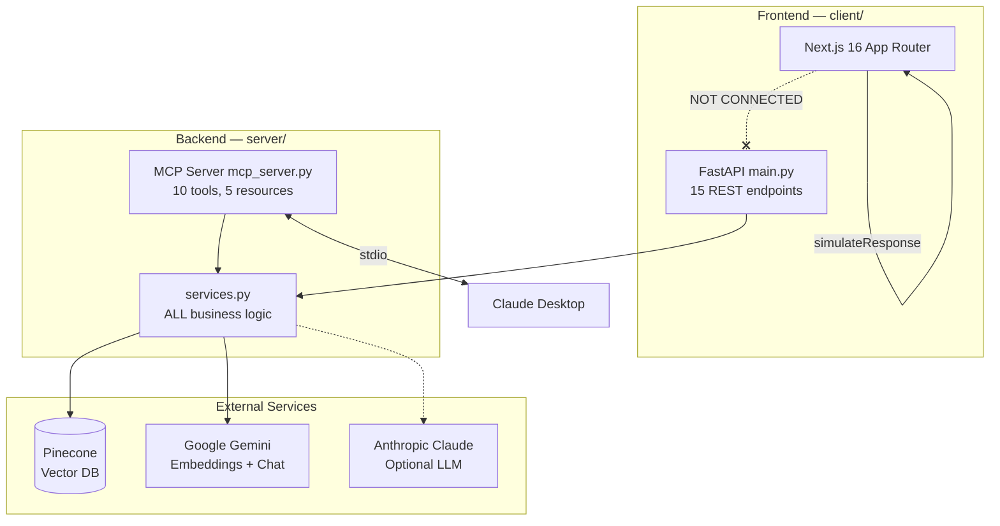
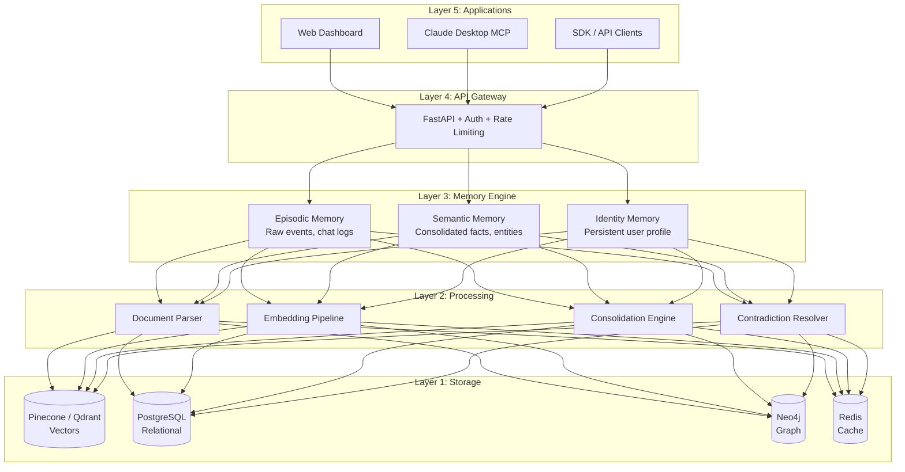

# Mnemonic — Technical Architecture

> **Version**: 0.2.0 · **Status**: Living Document · **Last Updated**: 2026-03-11

---

## 1. Executive Summary

Mnemonic is an AI memory infrastructure platform evolving from a Personal Brain MCP Server. The current system provides semantic search, document archival, and retrieval-augmented generation (RAG) backed by Pinecone vector storage and Google Gemini/Anthropic Claude LLMs.

**Current state**: Working prototype with a functional backend (FastAPI, 15 endpoints, 10 MCP tools) and a standalone frontend (Next.js 16, 4 pages, 23 components) that are **not connected to each other**. The frontend renders simulated responses. The backend has no authentication, no relational database, and CORS open to all origins.

**Target state**: A production-grade memory platform with three-tier memory (Episodic → Semantic → Identity), PostgreSQL for relational data, JWT authentication, and a fully wired frontend with 7+ pages.

---

## 2. System Overview

### Current Topology



**Critical gap**: The dashed line between frontend and backend represents the most important missing connection in the system. The Next.js app calls `simulateResponse()` instead of the API.

---

## 3. Current Architecture (Honest Assessment)

### 3.1 Backend

| File | Lines | Purpose | Issues |
|------|-------|---------|--------|
| `server/main.py` | 364 | FastAPI app, 15 REST endpoints | CORS `allow_origins=["*"]`, no auth, no rate limiting |
| `server/personal_brain_mcp/services.py` | 938 | **ALL** business logic | God module — file parsing, vectors, LLM, RAG, chat mgmt |
| `server/personal_brain_mcp/models.py` | 88 | 10 Pydantic models | Clean, well-structured |
| `server/personal_brain_mcp/config.py` | 16 | 4 environment variables | Minimal — no validation, no defaults |
| `server/mcp_server.py` | 530 | MCP server (duplicate of package) | **Tech debt**: duplicates `personal_brain_mcp/server.py` logic |

#### Known Bugs & Stubs

- **Hardcoded relevance scores**: `relevance_score=0.85` appears 5 times in `services.py` (lines 212, 220, 258, 266, 389) — should come from vector search similarity
- **Stub `delete_saved_chat()`** (line 789): Comments say "placeholder — in production, you'd need to implement this"
- **`get_all_documents("*")`** (line 322): Searches with literal `"*"` query string as a hack to list all documents
- **Fake pagination**: `get_all_documents` fetches all docs then slices in Python — no actual offset/limit at the DB level
- **Duplicate file parsing**: Both `main.py` and `services.py` contain parsing logic

### 3.2 Frontend

| Metric | Value |
|--------|-------|
| Framework | Next.js 16.0.1, React 19, TailwindCSS 4 |
| Pages | 4: `/` (landing), `/brain` (dashboard), `/demo` (problem solver), `/architecture` (tech details) |
| Components | 23 across 5 feature areas: landing (6), brain (5), demo (4), architecture (3), ui (5) |
| API Calls | **Zero** — `simulateResponse()` in `brain/page.tsx` generates fake responses |
| State Management | `useMemoryStore()` hook — client-side only memory engine |
| Backend Integration | None |

The frontend is a complete, buildable Next.js application with animations (framer-motion), charts (recharts), a D3 temporal graph, and resizable panels — but it talks to no backend.

### 3.3 MCP Server

- **10 tools**: archive_chat, search_memory, upload_document, chat_with_brain, search_documents, list_documents, get_document, import_chat, save_chat, retrieve_chats
- **5 resources**: documents://list, documents://{id}, search://documents/{query}, chats://saved, chats://{id}
- Works with Claude Desktop via stdio transport
- **Tech debt**: `mcp_server.py` (530 lines) duplicates logic from `personal_brain_mcp/server.py`

---

## 4. Target Architecture

### Five-Layer Model



### Three-Tier Memory Model

| Tier | Name | Analogy | Storage | Write Path | Read Path |
|------|------|---------|---------|------------|-----------|
| 1 | **Episodic** | Short-term | Append-only event log | Real-time (< 10ms) | Recent N events |
| 2 | **Semantic** | Long-term | Knowledge graph + vectors | Consolidation (async) | Semantic search |
| 3 | **Identity** | Core self | Compiled profile | Consolidation → merge | Direct lookup |

### MCP Protocol — 7 Core Operations

1. `memory.append` — Write event to episodic memory
2. `memory.search` — Semantic search across all tiers
3. `memory.consolidate` — Trigger offline consolidation
4. `memory.recall` — Retrieve specific memory by ID
5. `memory.forget` — Mark memory for removal
6. `memory.compile` — Generate identity summary
7. `memory.status` — Health check + stats

### Open Core Model

- **Core (OSS)**: Memory engine, basic MCP tools, single-user mode
- **Pro**: Multi-user, team memory, advanced analytics
- **Enterprise**: SSO, compliance, custom integrations

---

## 5. Data Architecture

### Current State: Pinecone Only

```
Pinecone Index
├── type: "document"     → uploaded file chunks
├── type: "chat_archive" → archived conversations
└── type: "saved_chat"   → saved chat sessions

Metadata fields: document_id, session_id, tool, tags, filename,
                 content_type, chunk_index, total_chunks, timestamp
```

**Limitations**: No relational queries, no user accounts, no session management, pagination faked in Python.

### Phase 1: + PostgreSQL

```
PostgreSQL
├── users          → accounts, auth tokens
├── sessions       → active sessions, CSRF
├── documents      → metadata, ownership
├── chats          → conversation metadata, message counts
└── memory_events  → episodic memory log

Pinecone (unchanged)
└── Vector embeddings for semantic search
```

### Phase 2+: Full Stack

| Store | Purpose | When |
|-------|---------|------|
| **Pinecone** → **Qdrant** | Vector search (self-hosted option) | Phase 2 |
| **Neo4j** | Knowledge graph, entity relationships | Phase 2 |
| **ClickHouse** | Analytics, usage metrics, billing | Phase 3 |
| **Redis** | Caching, rate limiting, real-time state | Phase 1 |

---

## 6. API Architecture

### Current Endpoints (15)

| Method | Path | Purpose | Auth |
|--------|------|---------|------|
| `GET` | `/` | Serve frontend | None |
| `GET` | `/api/health` | Health check | None |
| `POST` | `/upsert` | Upload & process file | None |
| `POST` | `/chat` | Streaming chat (SSE) | None |
| `POST` | `/chat/enhanced` | Chat with citations | None |
| `POST` | `/archive/chat` | Archive chat session | None |
| `GET` | `/search` | Search archived chats | None |
| `GET` | `/search/documents` | Search uploaded docs | None |
| `GET` | `/documents` | List all documents | None |
| `GET` | `/documents/{id}` | Get document by ID | None |
| `POST` | `/import/chat` | Import chat export | None |
| `POST` | `/chats/save` | Save conversation | None |
| `POST` | `/chats/retrieve` | Retrieve saved chats | None |
| `GET` | `/chats` | List saved chats | None |
| `DELETE` | `/chats/{id}` | Delete saved chat | None |

### Phase 1 Additions

| Method | Path | Purpose |
|--------|------|---------|
| `POST` | `/auth/register` | Create account |
| `POST` | `/auth/login` | Get JWT token |
| `POST` | `/auth/refresh` | Refresh token |
| `GET` | `/auth/me` | Current user profile |
| `POST` | `/memory/append` | Episodic memory write |
| `POST` | `/memory/consolidate` | Trigger consolidation |
| `GET` | `/memory/status` | Memory engine stats |

### Target: OpenAPI 3.1

- Versioned: `/api/v1/...`
- Rate limited: 100 req/min (free), 1000 req/min (pro)
- Authentication: Bearer JWT
- Response envelope: `{ data, error, meta }`

---

## 7. Frontend Architecture

### Current (4 Pages)

| Route | Purpose | Backend Integration |
|-------|---------|-------------------|
| `/` | Landing page — hero, problem, architecture, comparison, CTA | None |
| `/brain` | 3-panel dashboard — chat, widgets, memory dashboard | `simulateResponse()` only |
| `/demo` | Interactive problem solver with guided + freestyle modes | Client-side simulation |
| `/architecture` | Pipeline animation, benchmarks, academic context | Static content |

### Phase 1 (API Connection)

- Replace `simulateResponse()` with `fetch('/chat/enhanced')`
- Wire document upload to `/upsert`
- Wire memory dashboard to `/search`
- Add loading states, error handling, retry logic

### Target (7 Pages)

| Route | Purpose |
|-------|---------|
| `/` | Landing page (current) |
| `/brain` | Memory dashboard (current, wired) |
| `/demo` | Interactive demo (current, wired) |
| `/architecture` | Technical docs (current) |
| `/auth` | Login / register |
| `/settings` | User profile, API keys, integrations |
| `/analytics` | Memory usage, consolidation stats |

---

## 8. Security Architecture

### Current State (Critical Gaps)

| Concern | Status |
|---------|--------|
| Authentication | **None** — no user accounts |
| Authorization | **None** — all endpoints public |
| CORS | `allow_origins=["*"]` — open to all |
| Rate Limiting | **None** |
| Input Validation | Pydantic models (partial) |
| Secret Management | `.env` file, no rotation |
| HTTPS | Not enforced |
| Logging | MCP server only (`mcp_server.log`) |

### Phase 1 Targets

- **JWT authentication** with refresh tokens
- **CORS restricted** to specific origins
- **Rate limiting** via Redis (100 req/min default)
- **Input validation** on all endpoints (Pydantic V2)
- **HTTPS** enforced in production
- **Secrets** via environment variables, validated at startup

### Target State

- OAuth 2.0 / OIDC (Google, GitHub SSO)
- Role-Based Access Control (RBAC)
- GDPR compliance (data export, right to deletion)
- Audit logging
- Key rotation
- WAF integration

---

## 9. Migration Roadmap

### Phase 0: Foundation (Current Sprint)

- [x] Clean repo structure (archive old files)
- [x] Technical architecture document
- [x] Next.js frontend with component library
- [x] Three.js neural network visualization
- [x] 3-panel brain dashboard
- [ ] Unit test framework setup

### Phase 1: Wire + Auth (Next Sprint)

- [ ] PostgreSQL schema + migrations (Alembic)
- [ ] JWT authentication middleware
- [ ] Connect frontend to backend (`/chat/enhanced`, `/upsert`, `/search`)
- [ ] CORS lockdown
- [ ] Rate limiting (Redis)
- [ ] Error handling + retry logic in frontend
- [ ] CI/CD pipeline (GitHub Actions)
- [ ] Docker Compose for local dev

### Phase 2: Memory Engine

- [ ] Three-tier memory model implementation
- [ ] Async consolidation pipeline
- [ ] Contradiction detection & resolution
- [ ] Neo4j knowledge graph integration
- [ ] MCP protocol v2 (7 operations)
- [ ] WebSocket support for real-time updates

### Phase 3: Platform

- [ ] Multi-user support
- [ ] Team/organization memory
- [ ] Analytics dashboard (ClickHouse)
- [ ] SDK (Python, TypeScript)
- [ ] Plugin system
- [ ] OAuth / SSO
- [ ] Billing integration

---

## 10. Technology Decisions

| Choice | Selected | Rationale |
|--------|----------|-----------|
| **Backend framework** | FastAPI | Async-native, auto OpenAPI docs, Pydantic integration |
| **Frontend framework** | Next.js 16 | App Router, RSC, strong ecosystem, Vercel deployment |
| **Vector database** | Pinecone (→ Qdrant) | Managed service for MVP; Qdrant for self-hosted option |
| **Relational DB** | PostgreSQL | Industry standard, JSON support, full-text search |
| **Graph DB** | Neo4j (Phase 2) | Best-in-class for knowledge graphs |
| **LLM provider** | Google Gemini + Claude | Gemini for embeddings, Claude for complex reasoning |
| **Orchestration** | LangChain | RAG chain abstraction, multi-provider support |
| **Auth** | JWT + OAuth 2.0 | Stateless tokens, standard SSO integration |
| **Cache** | Redis | Rate limiting, session cache, pub/sub |
| **Styling** | TailwindCSS 4 | Utility-first, consistent design system |
| **Animation** | Framer Motion + Three.js | Motion for UI, Three.js for data visualization |
| **MCP** | FastMCP | Standard protocol for Claude Desktop integration |

---

## 11. Appendix

### Required Environment Variables

| Variable | Service | Required |
|----------|---------|----------|
| `GOOGLE_API_KEY` | Gemini embeddings + chat | Yes |
| `PINECONE_API_KEY` | Vector database | Yes |
| `PINECONE_INDEX_NAME` | Pinecone index | Yes |
| `ANTHROPIC_API_KEY` | Claude LLM | Optional |

### Key Source Files

| Path | Lines | Purpose |
|------|-------|---------|
| `server/main.py` | 364 | FastAPI application entry point |
| `server/personal_brain_mcp/services.py` | 938 | All business logic |
| `server/personal_brain_mcp/models.py` | 88 | Pydantic data models |
| `server/personal_brain_mcp/config.py` | 16 | Environment configuration |
| `server/mcp_server.py` | 530 | MCP server for Claude Desktop |
| `client/app/brain/page.tsx` | ~160 | Brain dashboard (3-panel layout) |
| `client/lib/use-memory-engine.ts` | ~300 | Client-side memory engine |
| `client/lib/use-memory-store.ts` | ~95 | React state wrapper for memory engine |

### Glossary

| Term | Definition |
|------|------------|
| **Episodic Memory** | Raw, timestamped events — chat messages, observations, uploads |
| **Semantic Memory** | Consolidated facts extracted from episodic data — entities, relationships |
| **Identity Memory** | Compiled user profile — persistent preferences, traits, goals |
| **Consolidation** | Async process that promotes episodic events to semantic/identity memory |
| **MCP** | Model Context Protocol — standard for connecting AI models to external tools |
| **RAG** | Retrieval-Augmented Generation — using vector search to ground LLM responses |
